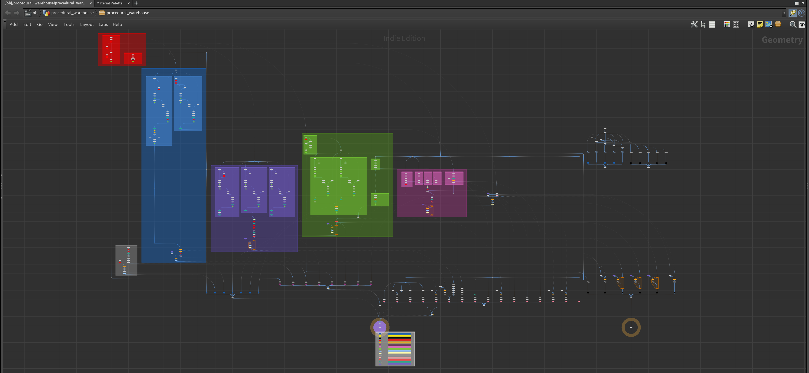
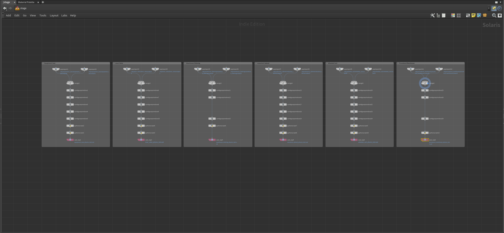

# Procedural Warehouse Simulation

A procedural warehouse simulation environment generator built in SideFX Houdini for robotics training. Generates physically accurate industrial environments modeled after North American Class A distribution center specifications, with articulated assets (cabinets, shelving,

 carts, valves, equipment cases), exports USD with complete UsdPhysics schemas (rigid bodies, collision proxies, joint hierarchies), and validates in NVIDIA Isaac Sim. Layout logic follows OSHA 1910.176, NFPA 13, NEC 110.26, and ANSI MH16.1 with configurable compliance parameters. Orchestrated through TOPs/PDG for batch generation of hundreds of unique environment variants from a single tool interface.

---

## Visual Showcase

### Procedural Generation Demo

<video src="https://github.com/user-attachments/assets/68b76c8e-058b-4b9a-a0e7-b34d9c352450" width="100%" autoplay loop muted playsinline></video>

### Warehouse Environment

### Procedural Networks
![SOP network graph showing procedural geometry generation]

### Articulated Assets

### Isaac Sim Validation

---

## Features

- **Procedural warehouse layout generation** modeled after North American Class A distribution center specifications (OSHA 1910.176, NFPA 13, NEC 110.26, ANSI MH16.1) with configurable compliance parameters
- **Five articulated asset HDAs** with full UsdPhysics schemas:
  - Equipment Case — revolute joint lid, latch mechanism
  - Lever Valve — revolute joint with angular limits, pipe-mounted
  - Warehouse Shelving — multi-tier pallet racking, adjustable heights
  - Industrial Cabinet — revolute door joints, prismatic drawer joints
  - Wheeled Cart — fixed/swivel wheel joints, rolling platform
- **Complete USD physics authoring** via Python LOPs:
  RigidBodyAPI, CollisionAPI (convexHull), joint hierarchies with drive targets
- **Validated Houdini-to-Isaac Sim pipeline** with correct physics behavior
- **Modular three-layer HDA architecture** (SOP geometry / LOP physics / TOPs batch)
- **Batch variant generation** through TOPs/PDG
- Configurable violation rate for realistic warehouse messiness
- Regional configuration support (US GMA pallet / EU EUR pallet standards)

---

## Technical Stack

- **Houdini** — VEX, Python, TOPs/PDG, LOPs/Solaris, Karma XPU, HDA development
- **USD/OpenUSD** — UsdPhysics schemas, UsdShade materials, composition arcs
- **NVIDIA Isaac Sim** — Physics validation, articulated asset testing
- **Python** — USD authoring scripts, pipeline automation

---

## Architecture

The pipeline follows a three-layer HDA architecture:

1. **SOP Layer** — Procedural geometry generation, layout logic, asset placement with collision avoidance and standards-compliant clearances
2. **LOP Layer** — USD scene assembly, UsdPhysics schema application (RigidBodyAPI, CollisionAPI, joint definitions), material assignment
3. **TOPs Layer** — PDG-orchestrated batch generation of environment variants with parameterized randomization across layout, assets, and materials

---

## Status

**Work in progress.** Core procedural warehouse generation and articulated asset library complete and validated in Isaac Sim. Environment texturing, additional asset types, and sensor data integration in active development.

---

## Related Work

- [**Houdini Synthetic Data Generation Pipeline**](https://github.com/nathankimnguyen412/houdini-sdg-pipeline): End-to-end synthetic data pipeline achieving 95.1% AP@50 on real-world evaluation from purely synthetic Houdini-generated training data. Published dataset on [Hugging Face](https://huggingface.co/datasets/nathankimnguyen412/houdini-lego-sdg).
